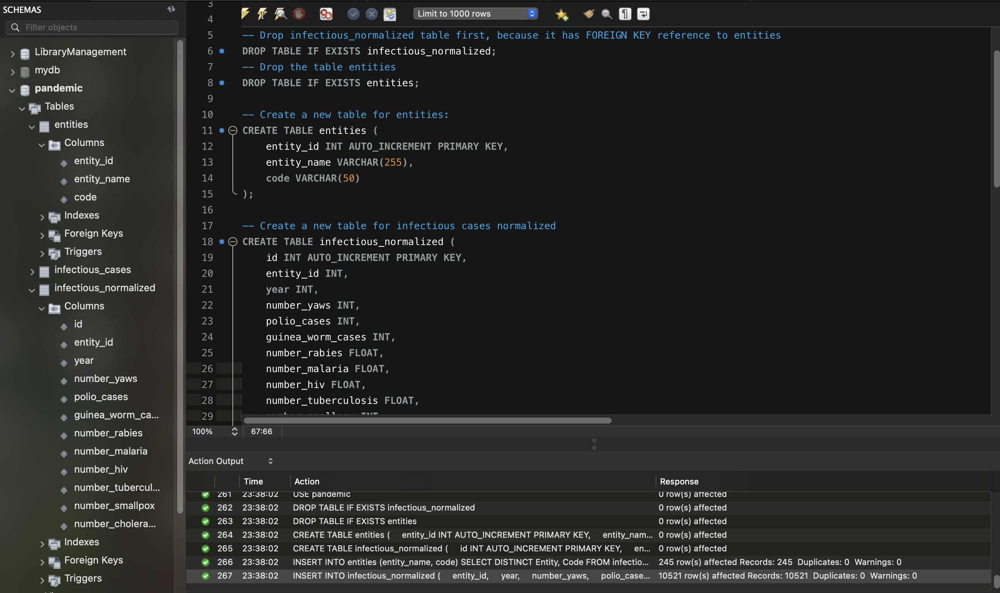

# Final Project

## Завдання

1. Завантажте дані:
  - Створіть схему `pandemic` у базі даних за допомогою SQL-команди.
  - Оберіть її як схему за замовчуванням за допомогою SQL-команди.
  - Імпортуйте дані за допомогою Import wizard так, як ви вже робили це у темі 3.
  - Продивіться дані, щоб бути у контексті.

2. Нормалізуйте таблицю `infectious_cases` до 3ї нормальної форми. Збережіть у цій же схемі дві таблиці з нормалізованими даними.

3. Проаналізуйте дані:
  - Для кожної унікальної комбінації `Entity` та `Code` або їх `id` порахуйте середнє, мінімальне, максимальне значення та суму для атрибута `Number_rabies`.
  - Результат відсортуйте за порахованим середнім значенням у порядку спадання.
  - Оберіть тільки 10 рядків для виведення на екран.

4. Побудуйте колонку різниці в роках.
Для оригінальної або нормованої таблиці для колонки `Year` побудуйте з використанням вбудованих SQL-функцій:
  - атрибут, що створює дату першого січня відповідного року,
  - атрибут, що дорівнює поточній даті,
  - атрибут, що дорівнює різниці в роках двох вищезгаданих колонок.

5. Побудуйте власну функцію.
  - Створіть і використайте функцію, що будує такий же атрибут, як і в попередньому завданні: функція має приймати на вхід значення року, а повертати різницю в роках між поточною датою та датою, створеною з атрибута року (1996 рік → ‘1996-01-01’).

---

## Виконання

### 1. Завантаження даних

- Створили схему pandemic:

```sql
CREATE DATABASE pandemic;
USE pandemic;
```

- Далі імпортуємо дані з CSV-файлу infectious_cases.csv через Import Wizard.

- Переглядаємо вміс таблиці:

```sql
SELECT * FROM infectious_cases LIMIT 20;
```


- Підраховуємо кільксть рядків:

```sql
SELECT COUNT(*) FROM infectious_cases;
```


---

### 2. Нормалізація таблиці `infectious_cases` до 3-ї нормалі

#### 2.1. Створення таблиць

- Створення таблиці `entities`

```sql
CREATE TABLE entities (
	entity_id INT AUTO_INCREMENT PRIMARY KEY,
	entity_name VARCHAR(255),
	code VARCHAR(50)
);
```

- Створення таблиці `infectious_normalized`

```sql
CREATE TABLE infectious_normalized (
	id INT AUTO_INCREMENT PRIMARY KEY,
	entity_id INT,
	year INT,
	number_yaws INT,
	polio_cases INT,
	guinea_worm_cases INT,
	number_rabies FLOAT,
	number_malaria FLOAT,
	number_hiv FLOAT,
	number_tuberculosis FLOAT,
	number_smallpox INT,
	number_cholera_cases INT,
	FOREIGN KEY (entity_id) REFERENCES entities(entity_id)
);
```

#### 2.2. Наповнення нормалізованих таблиць даними

- Вставка унікальних Entity + Code:

```sql
INSERT INTO entities (entity_name, code)
SELECT DISTINCT Entity, Code FROM infectious_cases;
```

- Вставка нормалізованих даних:

```sql
INSERT INTO infectious_normalized (
	entity_id,
	year,
	number_yaws,
	polio_cases,
	guinea_worm_cases,
	number_rabies,
	number_malaria,
	number_hiv,
	number_tuberculosis,
	number_smallpox,
	number_cholera_cases
)
SELECT 
	e.entity_id,
	ic.Year,
	ic.Number_yaws,
	ic.polio_cases,
	ic.cases_guinea_worm,
	ic.Number_rabies,
	ic.Number_malaria,
	ic.Number_hiv,
	ic.Number_tuberculosis,
	ic.Number_smallpox,
	ic.Number_cholera_cases
FROM infectious_cases ic
JOIN entities e ON ic.Entity = e.entity_name AND ic.Code = e.code;
```



---

### 3. Аналіз: агрегація по `number_rabies`

```sql
SELECT 
	e.entity_name,
	e.code,
	AVG(inor.number_rabies) AS avg_rabies,
	MIN(inor.number_rabies) AS min_rabies,
	MAX(inor.number_rabies) AS max_rabies,
	SUM(inor.number_rabies) AS total_rabies
FROM infectious_normalized inor
JOIN entities e ON inor.entity_id = e.entity_id
WHERE inor.number_rabies IS NOT NULL
GROUP BY e.entity_name, e.code
ORDER BY avg_rabies DESC
LIMIT 10;
```


---

### 4. Колонка з різницею в роках

```sql
SELECT 
	id,
	year,
	DATE(CONCAT(year, '-01-01')) AS year_date,
	CURRENT_DATE() AS c_date,
	TIMESTAMPDIFF(YEAR, DATE(CONCAT(year, '-01-01')), CURRENT_DATE()) AS year_diff
FROM infectious_normalized;
```


---

### 5. Функція для обчислення різниці в роках

```sql
DROP FUNCTION IF EXISTS year_diff;

DELIMITER //

CREATE FUNCTION year_diff(input_year INT)
RETURNS INT
DETERMINISTIC
BEGIN
	RETURN TIMESTAMPDIFF(YEAR, DATE(CONCAT(input_year, '-01-01')), CURRENT_DATE());
END //


DELIMITER ;

-- Приклад використання функції
SELECT 
	id, 
	year, 
	year_diff(year) AS year_difference
FROM infectious_normalized;
```


